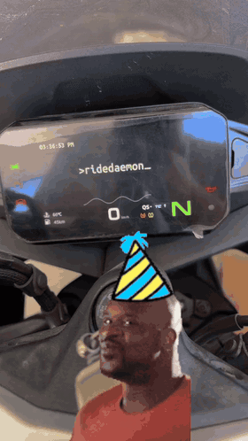

# Summer Zephyr

Summer Zephyr is a modular Android dashboard and projection client built on
[ridedaemon-lib](https://github.com/charliecharlieO-o/ridedaemon-lib), the core
Go transport library. It scans the HUD's Wi-Fi QR code, connects to the head
unit, renders configurable scenes with `MediaCodec`, and streams them to the
motorcycle display.

**This is a demo/reference implementation, not a polished product.** It
exists to prove the integration works end-to-end and to give you a working
example to build from. Expect rough edges (a hardcoded delay here, an
unused stub screen there). See [Known rough edges](#known-rough-edges) below.

## Demo



## What it does

1. **Scan QR** (`feature/ap/QrScanScreen.kt`). Uses CameraX + ML Kit to
   read the HUD's setup QR code, which encodes its WiFi AP credentials as a
   URL (`ssid`, `pwd`, `auth`, etc).
2. **Connect to the HUD's AP** (`feature/ap/WifiApController.kt`). Suggests
   that network to Android via `WifiNetworkSuggestion`, then watches
   connectivity callbacks for the HUD's subnet (`192.168.0.x`) to confirm
   we're actually on its network.
3. **Discover + stream** (`core/hud/HudStreamController.kt`). Once
   connected, resolves the HUD over mDNS (`_EasyConn._tcp.`) using Android's
   `NsdManager`, opens a `MobileSession` from the Go library (via the
   `hudlib.aar` gomobile bindings), and starts a local encoder.
4. **Encode + render** (`core/hud/HudEncoder.kt`,
   `core/hud/Hud2DRenderer.kt`). A `MediaCodec` surface encoder produces
   H.264 (AVCC) samples from whatever's drawn on its input `Surface`; a
   small custom 2D scene renderer (`HudScene`/`HudElement`) draws onto that
   surface every frame (backgrounds, animated images, dynamic text, even a
   sine wave, useful building blocks for a real dashboard UI). Each encoded
   sample is handed to `MobileSession.pushFrame()`, which the Go library
   converts to Annex-B and streams to the HUD.
5. **HUD events**. `HudStreamController` listens for events coming back
   from the library (e.g. the HUD's safe-area/view config) and reacts to
   them, e.g. sizing the encoder to match what the HUD reports.

## Project layout

| Path | What's there |
|---|---|
| `core/hud/` | Everything HUD-specific: session/controller, `MediaCodec` encoder, and the 2D scene renderer used to draw content before it's encoded. |
| `core/qr/` | QR parsing/analysis (`QrAnalyzer`) for the HUD's WiFi setup code. |
| `feature/ap/` | WiFi AP connection flow: QR scan screen + `WifiApController`. |
| `feature/hud/` | User-facing connection screen plus a separate developer panel for diagnostics and test scenes. |
| `feature/login/` | An unused stub, see below. |
| `navigation/` | Compose navigation graph (`Hud` / `QrScan` / `Login` routes). |

## Setup

1. Build the Go library's Android bindings (see the
   [ridedaemon-lib](../ridedaemon-lib) README) and drop the resulting AAR at:
   ```
   app/libs/hudlib.aar
   ```
   The app depends on it directly via `implementation(files("libs/hudlib.aar"))`
   in `app/build.gradle.kts`.
2. Open in Android Studio or build from the CLI:
   ```bash
   ./gradlew assembleDebug
   ```
3. Install on a phone (not an emulator; you'll need real WiFi/camera/NSD).
   `minSdk` is 29.

## Known rough edges

Being upfront about what's demo-quality here, so it's clear what to firm up
before leaning on this as a template:

- **`feature/login/LoginScreen.kt` is an empty stub.** It's wired into the
  nav graph but never actually navigated to or implemented. Leftover
  scaffolding from an earlier idea, safe to remove or build out.
- **`HudStreamController.onHudConnected` has a hardcoded 8-second delay**
  before starting the stream, to give the HUD's app time to settle after
  the WiFi handoff. This works but isn't principled. Note: a retry/backoff on
  the actual mDNS resolution would be more robust than a flat sleep.
- **Package/application ID:** `com.goose.summerzf`.
- No tests.

None of this blocks it working as a demo. Just don't treat the patterns
above as the recommended way to do things in a production app.

## Status

Not affiliated with or endorsed by CFMoto. Built to work with hardware I
own, using the ridedaemon-lib transport.

## License

GPL-3.0. See [LICENSE](LICENSE.md) (same terms as the core library).

In short:

**You can:**
- Use, study, and modify this code, including commercially.
- Redistribute it, modified or not.
- Ship it as part of a larger project.

**You can't:**
- Redistribute it (or anything that includes it) as closed source. Any
  distributed derivative work must also be GPL-3.0 and include source.
- Hold Summer Zephyr or its contributors liable. It's provided with no
  warranty.
- Sublicense it under different, more restrictive terms.

This is a plain-language summary, not a substitute for the license text.
The [LICENSE](LICENSE.md) file is what actually governs.

## Diagnostics build additions

This working tree includes a diagnostics-oriented extension intended to make
protocol and renderer development easier before integrating a map engine.

- The video path remains fixed at **800x400**, 30 fps, and 2.5 Mbps. The HUD's
  reported safe-area dimensions are logged but do not reconfigure the encoder.
- `HudConnectionState` exposes discovery, session, encoder, streaming, stopping,
  and error states through a `StateFlow`.
- Renderer and encoder statistics are sampled once per second: measured FPS,
  encoded bitrate, total frames, missed render deadlines, pushed frames, and
  `pushFrame` failures.
- Every event exposed by `MobileCallback.onEvent()` is retained with a local
  timestamp and the original protocol timestamp/type. Payloads are recorded as
  readable UTF-8 when possible and hex otherwise. Event names are intentionally
  not guessed until physical control tests establish the mapping.
- New sessions start on a neutral user-facing standby scene. The diagnostics
  overlay and original animated time/sine-wave scene are available only from
  the **Developer tools** panel in the app-bar overflow menu.
- The main screen contains only connection and navigation-facing status. The
  developer panel contains the diagnostics card, recent events, log export, and
  test-scene controls.
- **Share diagnostics log** exports the in-memory session/event log through an
  Android `FileProvider` share sheet.

The primary additions are in:

```text
core/hud/HudDiagnostics.kt
core/hud/HudStreamController.kt
core/hud/HudEncoder.kt
core/hud/HudRenderer.kt
feature/hud/HudScreen.kt
feature/hud/HudDebugScreen.kt
res/xml/file_paths.xml
```

## Background streaming

The HUD session is process-wide and owned by `HudStreamService`, an Android foreground service. While streaming it holds a partial CPU wake lock and a high-performance Wi-Fi lock, so changing apps or locking the phone does not intentionally tear down the encoder or the three EasyConn TCP channels. Use the in-app **Stop** button or the notification action to end the stream.

## Modular HUD themes

The user-facing scene is now composed from independent widgets on the fixed
**800×400** motorcycle canvas. The current component set is:

- **Map** — live phone location rendered with MapLibre into an off-screen
  bitmap. Map rendering is asynchronous; the 30 fps H.264 loop always reuses
  the most recent completed bitmap instead of performing tile work in the
  encoder thread.
- **Now playing** — active Android media title, artist, source application,
  artwork, and playback state. The user must grant the app Notification Access
  from the Theme creator before metadata from other media apps is available.
- **Clock** — optional overlay component.

Open **Customize display** from the main screen to use the Theme creator. It
provides:

- a scale-accurate 800×400 preview;
- drag-to-move and lower-right drag-to-resize controls;
- an 8 px snap grid and per-widget minimum sizes;
- non-overlapping primary map/media panels;
- live updates while the HUD stream is active;
- persistent layouts stored in `SharedPreferences`;
- Map + media, Full map, and stacked presets;
- Night, Amber, and Ice palettes.

The default preset places the map in approximately two thirds of the display
and now-playing information in the remaining third. Enabling media while using
the Full map preset automatically reflows both primary panels into this safe
layout.

The main extension points are:

```text
core/theme/HudTheme.kt             persisted layout and constraints
core/theme/HudThemeRepository.kt   theme state and storage
core/theme/HudSceneComposer.kt     widget renderer registry/composition
core/content/HudContentData.kt      dynamic values consumed by scenes
core/content/HudContentRuntime.kt   widget data-provider lifecycle
core/map/HudMapRuntime.kt           location and MapLibre snapshots
core/media/HudMediaRuntime.kt       media-access bridge
core/media/HudMediaListenerService.kt
feature/theme/ThemeEditorScreen.kt  user layout editor
```

This is the map/component foundation, not a complete turn-by-turn navigation
engine yet. Route calculation, maneuver instructions, offline tile packs, and
handlebar-control mapping remain later modules.

## Projection scenes

The modular HUD now exposes four user scene modes without changing the fixed
800x400 MotoPlay stream:

- **Custom dashboard** keeps the MapLibre/media-widget theme system.
- **Cast a selected app** uses Android 14's app-aware MediaProjection picker.
- **Mirror whole screen** restricts MediaProjection to the default display.
- **Android Auto** is represented by a gated receiver boundary. The public
  MOTO-HUB source intentionally omits the private `aa_cert` and
  `aa_identity_data` head-unit identity, and its embedded receiver is a
  separate AAP/TLS/decoder/compositor stack. This build does not claim to
  provide Android Auto until that independently reviewed module and private
  identity are supplied.

Screen/app capture runs inside the existing foreground service. Frames are
captured into an `ImageReader`, limited to 30 fps, copied into two reusable
800x400 bitmaps, and consumed by the existing Canvas/MediaCodec pipeline.
The user can select **Fit** or **Fill** without reconnecting to the motorcycle.
Android still requires explicit approval for each new MediaProjection session,
and secure/protected app surfaces may appear black.

## Private Android Auto scene

The Android Auto scene now has a private extension path. Normal builds remain
usable for the custom dashboard, selected-app casting, and whole-screen
mirroring without containing receiver source or head-unit credentials.

To prepare a private build:

```bash
./tooling/android-auto/import-motohub-receiver.sh /path/to/MOTO-HUB
./tooling/android-auto/install-identity.sh /path/to/cert.pem /path/to/key.pem
./gradlew \
  -PincludeAndroidAutoReceiver=true \
  -PincludeAndroidAutoIdentity=true \
  assemblePrivateAndroidAutoDebug
```

See [`docs/android-auto-private-build.md`](docs/android-auto-private-build.md)
for architecture, testing, and limitations. The repository intentionally does
not contain or copy a third party's private key.
